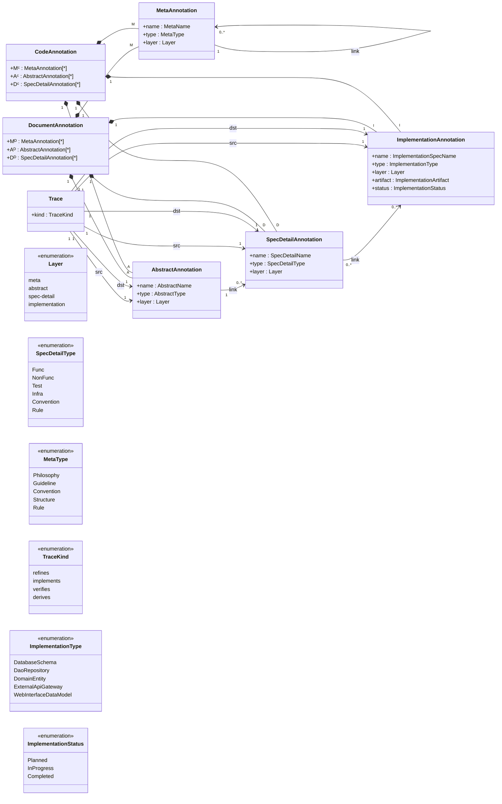

/// [@st-meta-model-doc] layer: meta, type: Philosophy, name: Specification Model: Formal Definition
# Specification Model: Formal Definition

> This document defines the formal metamodel and philosophical foundation of the SpecTrail system.
>
> It is intended as a stable conceptual reference.
> Implementation details, file formats, and tooling behavior are intentionally out of scope.

/// [@st-meta-non-goals] layer: meta, type: Guideline, name: Non-goals
## Non-goals

- This document does not define file formats.
- This document does not prescribe programming languages.
- This document does not define CLI behavior.

/// [@st-meta-doc-status] layer: meta, type: Structure, name: Document Status
## Document Status

Status: Draft (Conceptually stable, subject to naming refinements)

/// [@st-meta-specification] layer: abstract, type: Structure, name: Specification
## Specification

/// [@st-meta-spectrail-annotation] layer: abstract, type: Structure, name: SpecTrailAnnotation
### 1. SpecTrailAnnotation

/// [@st-meta-spectrail-unit] layer: abstract, type: Convention, name: SpecTrailUnit
#### 1.1 SpecTrailUnit

SpecTrail defines two parallel annotation domains that share a common structural schema:

```ebnf
SpecTrailUnit = { CodeAnnotation, DocumentAnnotation }
```

A SpecTrailUnit represents a traceable conceptual pair consisting of:

- CodeAnnotation — an annotation appearing in source code or code-related metadata.
- DocumentAnnotation — an annotation appearing in natural-language or semi-structured specification documents.

Together, these two components form the dual representation of a single conceptual specification element within the SpecTrail system.

### 1.2 SpecTrailAnnotation

Both domains on `SpecTrailUnit` are constructed from the same four-layer annotation structure:

- MetaAnnotation (M)
- AbstractAnnotation (A)
- SpecDetailAnnotation (D)
- ImplementationAnnotation (I)

Although they share the same schema, they exist in different ontological strata:

- DocumentAnnotation resides in the specification domain (textual representation).
- CodeAnnotation resides in the implementation domain (executable or machine-verified representation).

Formally:

```ebnf
DocumentAnnotation = { Mᴰ, Aᴰ, Dᴰ, Iᴰ }
CodeAnnotation     = { Mᶜ, Aᶜ, Dᶜ, Iᶜ }
```

Each component (M, A, D) follows the same structural definition across the two domains, but each should be explicitly understood as instantiated separately in DocumentAnnotation (Mᴰ, Aᴰ, Dᴰ) and in CodeAnnotation (Mᶜ, Aᶜ, Dᶜ), according to their respective representational media.

#### 1.2.1 Annotation Traceability

A Trace relation establishes semantic correspondence between DocumentAnnotation and CodeAnnotation.

```ebnf
∀ aᴰ ∈ DocumentAnnotation,
∃ aᶜ ∈ CodeAnnotation 

such that Trace(aᴰ, aᶜ)
```

The mapping is not required to be 1-to-1.
This accommodates partial mappings, composite mappings, and real-world divergences between intended specifications and implemented systems.

#### 1.2.2 Philosophical Note

DocumentAnnotation and CodeAnnotation are structurally isomorphic but ontologically distinct:

- The Document space describes intent.
- The Code space describes realization.

SpecTrail purposely does not collapse these spaces into a single ontology.
Instead, the system maintains their distinction while enforcing traceability between them.

#### 1.2.3 MetaAnnotation

MetaAnnotation describes design principles, naming conventions, and management-level guidelines.
It supports the structure of the specification but does not define system functionality directly.

MetaAnnotations generally do not appear in source code.

```ebnf
M = {m₁, ..., mₙ}

∀ m ∈ M:
    m = {n, t, l, link}  
    n ∈ MetaName  
    t ∈ MetaType
    l ∈ Layer
    link ⊆ {MetaAnnotation}
```

** MetaType includes **:

```ebnf
Philosophy | Guideline | Convention | Structure | Rule
```

** Layer **:

```ebnf
meta | abstract | spec-detail | implementation
```

** MetaName **:

MetaName is a string identifier for MetaAnnotation.  
A MetaName should be a unique entity across all MetaAnnotations.

** Semantics of MetaAnnotation **:

```aiignore
∀ m₁, m₂ ∈ MetaAnnotation, m₁ ≠ m₂ ⇒ m₁.MetaName ≠ m₂.MetaName
```

#### 1.2.4 AbstractAnnotation

AbstractAnnotation defines high-level conceptual units of the system:

- Why the system or component exists
- Which user needs or use cases it addresses
- What role it plays within the overall architecture

In web systems, it typically corresponds to:

- a page-level concept (e.g., ProductListPage)
- an application-level concept (e.g., UserAuthFlow)
- background components (API groups, batch processes, scheduled jobs)

Each AbstractAnnotation owns multiple SpecDetailAnnotations.

```ebnf
A = {a₁, ..., aₙ}

∀ a ∈ A:
    a = {na, ta, l, link}
    na ∈ AbstractName
    ta ∈ AbstractType
    l ∈ Layer
    link ⊆ SpecDetailAnnotation
```

#### 1.2.5 SpecDetailAnnotation

SpecDetailAnnotation represents concrete functional or structural specification derived from an AbstractAnnotation.

Examples include:

- API behavior
- data validation rules
- user interaction flows
- batch processing steps
- database structure definitions

```
D = {d₁, ..., dₖ}

∀ d ∈ D:
    d = {nd, td, l, link}
    nd ∈ SpecDetailName
    td ∈ SpecDetailType
    l ∈ Layer
    link ⊆ {AbstractAnnotation ∪ ImplementationAnnotation}
```

The link forms a bidirectional trace between:

- abstract concept (upward)
- implementation realization (downward)

1.2.6 ImplementationAnnotation

ImplementationAnnotation describes how a SpecDetailAnnotation is realized at the technical level.

It expresses conceptual implementation information without binding to physical file paths or language syntax.
Actual code metadata is managed by CodeAnnotation.

Examples:

- Database schema / table / field semantics
- DAO / repository structures
- domain entity definitions
- external API gateway design
- web interface data model

```
I = {i₁, ..., iₗ}

∀ i ∈ I:
    i = {ni, ti, l, link, art, status}
    ni ∈ ImplementationSpecName
    ti ∈ ImplementationType
    l ∈ Layer
    link ⊆ {SpecDetailAnnotation ∪ AbstractAnnotation}
    art ∈ ImplementationArtifact
    status ∈ ImplementationStatus
```

#### 1.2.7 ImplementationType

Defines the technical classification of an ImplementationAnnotation.

```
DatabaseSchema        : Table and field definitions
DaoRepository         : Data access logic
DomainEntity          : Business logic entities
ExternalApiGateway    : External system integration
WebInterfaceDataModel : API or UI data structures
```

1.2.8 Annotation Trace

Traces define explicit semantic relationships across all annotation layers.

```
T = {t₁, ..., tₘ}

∀ t ∈ T:
    t = {src, dst, kind}
    src ∈ (A ∪ D ∪ I)
    dst ∈ (A ∪ D ∪ I)
    kind ∈ TraceKind
```

TraceKind expresses semantics such as:

- refines: narrows or specializes a higher-level concept
- implements: realizes a specification in executable form
- verifies: validates behavior through tests or checks
- derives: is logically inferred from another annotation


Traces are the structural backbone of SpecTrail, ensuring full bidirectional traceability.


/// [@st-meta-vocabulary] layer: meta, type: Convention, name: Vocabulary
2. Vocabulary

/// [@st-meta-specdetailtype] layer: spec-detail, type: Structure, name: SpecDetailType
2.1 SpecDetailType

Defines the structural classification of a SpecDetailAnnotation.

```
Func      : Functional specification (behavior, state transitions, logic)
NonFunc   : Structural, static, or non-behavioral specifications
Test      : Validation logic and test case specifications
Infra     : Infrastructure-level specifications (DB, gateway, file formats)
Convention: Standard patterns or recurring structures
Rule      : Strict constraints or validation logic
```

/// [@st-meta-metamodel-diagrams] layer: meta, type: Structure, name: metamodel diagrams
3. metamodel diagrams


